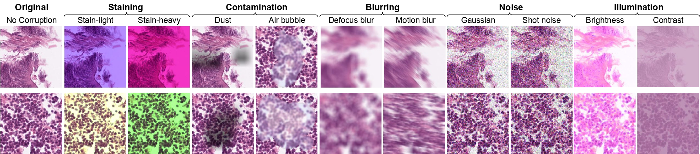
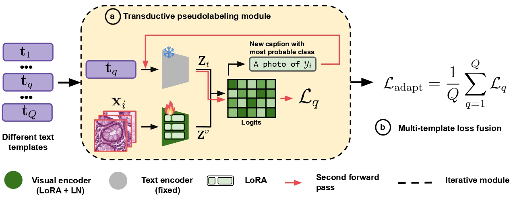

# Histopath-C: Towards Realistic Domain Shifts for Histopathology Vision-Language Adaptation

The official implementation of the method and benchmark introduced in our paper "Histopath-C: Towards Realistic Domain Shifts for Histopathology Vision-Language Adaptation".


## Abstract
<p align="justify">
Medical Vision-language models (VLMs) have shown remarkable performances in various medical imaging domains such as histo-pathology by leveraging pre-trained, contrastive models that exploit visual and textual information. However, histopathology images may exhibit severe domain shifts, such as staining, contamination, blurring, and noise, which may severely degrade the VLM's downstream performance. In this work, we introduce Histopath-C, a new benchmark with realistic synthetic corruptions designed to mimic real-world distribution shifts observed in digital histopathology. Our framework dynamically applies corruptions to any available dataset and evaluates Test-Time Adaptation (TTA) mechanisms on the fly. We then propose LATTE, a transductive, low-rank adaptation strategy that exploits multiple text templates, mitigating the sensitivity of histopathology VLMs to diverse text inputs. Our approach outperforms state-of-the-art TTA methods originally designed for natural images across a breadth of histopathology datasets, demonstrating the effectiveness of our proposed design for robust adaptation in histopathology images.
</p>


<p align="center">
    
    <em>Overview of the Histopath-C benchmark with five corruption families (stain, contamination, blur, noise, illumination).</em>
</p>

<p align="center">
    
    <em>LATTE: Low-rank Adaptation with Transductive Template Ensembling for test-time robustness.</em>
</p>


## Highlights

- 🔥 **[Histopath-C] Realistic benchmark for histopathology VLMs**
  - 10 corruption types across 5 families: staining, contamination, blur, noise, illumination  
  - Enables controlled, on-the-fly stress-testing on any histopathology dataset  
  - Includes corruption operators and evaluation scripts for reproducible robustness studies  
  - Supports different pathology VLMs  

- 🔥 **[LATTE] Pathology-specific SOTA test-time adaptation**
  - Low-rank adaptation with transductive template ensembling  
  - Can be applied to any Pathology VLM 
  - State-of-the-art performance over TTA baselines (TENT, TPT, LAME, CLIPArTT)
---


<details open>
<summary><b>📂 Supported Datasets</b></summary>

- **[NCT-CRC-HE-100K / CRC-VAL-HE-7K](https://zenodo.org/records/1214456)** – colorectal tissue classification  
- **[LC25000](https://arxiv.org/abs/1912.12142)** – lung & colon histopathology images  
- **[SkinCancer](https://doi.org/10.3389/fonc.2022.1022967)** – skin histopathology dataset for detection of neoplasms and tissue structures  
- **[RenalCell](https://doi.org/10.1101/2022.08.15.503955)** – renal cell carcinoma histopathology dataset  
- **[MHIST](https://bmirds.github.io/MHIST/)** – multi-class gastric histopathology dataset  
- **Other histopathology datasets** can be easily extended with the corruption suite  


</details>


<details open>
<summary><b>⚙️ Supported Methods</b></summary>

  - [TENT](https://arxiv.org/abs/2006.10726) 
  - [TPT](https://arxiv.org/abs/2209.07511) 
  - [LAME](https://arxiv.org/abs/2201.05718)
  - [CLIPArTT](https://arxiv.org/abs/2405.00754) 
  - LATTE (ours)

</details>


<details open>
<summary><b>🧩 Supported VLMs</b></summary>

- [Quilt-1M / QuiltNet](https://quilt1m.github.io/)
- [PathGen-1.6M](https://arxiv.org/abs/2407.00203)
- [CONCH](https://arxiv.org/abs/2307.12914)
- Easy to plug in additional pathology VLMs**


</details>


## Installation

To set up the environment for Histopath-C, run the following:

```bash
# Create and activate a new Conda environment
conda create -n histopath python=3.10.13 -y
conda activate histopath

# Install PyTorch with CUDA support
conda install pytorch=2.1.2 torchvision=0.16.2 torchaudio=2.1.2 pytorch-cuda=11.8 -c pytorch -c nvidia -y

# Install required Python packages
pip install opencv-python matplotlib pandas openpyxl
pip install open_clip_torch==2.29.0 transformers==4.48.2 h5py==3.12.0 scikit_image==0.24.0 numpy==1.26.4

# Install CONCH
pip install git+https://github.com/Mahmoodlab/CONCH.git
```

## Usage

Before running experiments, make sure you have:

1. **Datasets**  
   Download the supported histopathology datasets (e.g., NCT-CRC-HE-100K, LC25000, MHIST, PCam, SkinCancer, RenalCell).  
   Place them under the `datasets/` folder (see `datasets/README.md` for organization details).  

2. **Pretrained weights**  
   Download the CONCH model from [MahmoodLab/CONCH](https://huggingface.co/MahmoodLab/CONCH), rename to `conch.bin`, and place it in the `weights/` folder.  
   Download the PathGen model from [jamessyx/PathGen-CLIP](https://huggingface.co/jamessyx/PathGen-CLIP) and place it in the `weights/` folder.  
   For Quilt, no manual download is required — it will be fetched automatically.  


All bash files for experiments are provided in the `./bash/` directory.  For example, to run **Quilt + LATTE** on **NCT-7K**, you can use the following script:  

```bash
DATASET="nct"
DATA_DIR="path/to/NCT7k_val/dataset"

BACKBONE="hf-hub:wisdomik/QuiltNet-B-32"
CLIP_TYPE="open_clip"
METHOD="latte"
TEMP_DIR="templates/t25.yaml" 

BATCH_SIZE=128
STEPS=10
LEANING_RATE=0.001
TRIALS=3
WORKERS=0
AVG_TYPE="loss_avg"

# LoRA parameters
LORA_PARAMS="q k v o"
LORA_RANK=2
LORA_ALPHA=1
LORA_DROPOUT=0.0
LORA_LAYERS="0 1 2 3 4 5 6 7 8 9 10 11"

ALL_CORRUPTIONS="original gaussian_noise shot_noise defocus_blur motion_blur brightness contrast stain_light stain_heavy dust air_bubble"

LORA_PARAMS_DIR="${LORA_PARAMS// /_}"

SAVE_DIR="./save/quilt/${DATASET}/${METHOD}_Lora_LN_bs${BATCH_SIZE}_lr${LEANING_RATE}_s${STEPS}_t${AVG_TYPE}_P${LORA_PARAMS_DIR}_a${LORA_ALPHA}_r${LORA_RANK}"

CUDA_VISIBLE_DEVICES=0 python main.py \
    --clip_type $CLIP_TYPE --seed 42 --dataset $DATASET --data_dir $DATA_DIR --save_dir $SAVE_DIR \
    --workers $WORKERS --batch_size $BATCH_SIZE --steps $STEPS --lr $LEANING_RATE --trials $TRIALS \
    --corruptions_list $ALL_CORRUPTIONS \
    --method $METHOD --backbone $BACKBONE --temp_dir $TEMP_DIR --adapt --avg_type $AVG_TYPE \
    --lora_ln --lora_alpha $LORA_ALPHA --lora_dropout $LORA_DROPOUT --lora_rank $LORA_RANK \
    --lora_params $LORA_PARAMS --lora_layers $LORA_LAYERS
```

---


## Results

Below we report the average accuracies (%) on **Quilt** as the base VLM.  Each dataset is shown with its clean version and its corrupted version (*-C*), where *-C* indicates the mean over 10 realistic corruptions from Histopath-C.  More results (including other VLMs and full per-corruption breakdowns) are provided in the paper.  

| Dataset        | Source | TENT  | LAME  | TPT   | CLIPArTT | LATTE (Ours) |
|----------------|--------|-------|-------|-------|----------|--------------|
| NCT7K          | 60.86  | 61.65 | 68.91 | 58.00 | 67.01    | **69.24** |
| NCT7K-C        | 40.43  | 30.23 | 37.63 | 39.96 | 56.96    | **61.78** |
| NCT100K        | 55.98  | 41.42 | 64.06 | 52.83 | 59.86    | **68.14** |
| NCT100K-C      | 39.89  | 28.30 | 37.20 | 38.42 | 51.18    | **56.13** |
| LC25K-All      | 79.28  | 71.39 | **87.13** | 79.22 | 80.47    | 86.97 |
| LC25K-All-C    | 57.13  | 40.26 | 56.61 | 56.64 | 65.76    | **71.68** |
| Skin           | 44.22  | 24.31 | 40.09 | 45.16 | 46.42    | **50.62** |
| Skin-C         | 22.21  | 8.78  | 17.30 | 22.47 | 29.50    | **33.81** |
| Renal          | 49.76  | 43.19 | **50.77** | 50.29 | 43.28 | 46.14     |
| Renal-C        | 30.46  | 26.95 | 30.40 | 30.20 | 29.37    | **38.29** |
| MHIST          | 62.95  | 63.15 | 60.10 | 61.51 | –        | **64.02** |
| MHIST-C        | 57.75  | 55.05 | 53.29 | 57.60 | –        | **62.01** |


## License

This source code is released under the [MIT License](./LICENSE).  

This project also incorporates components from the following repositories, and we thank the authors for open-sourcing their work:  
1. [WATT](https://github.com/Mehrdad-Noori/WATT) (MIT Licensed)  
2. [LoRA](https://github.com/microsoft/LoRA) (Apache 2.0 Licensed)  